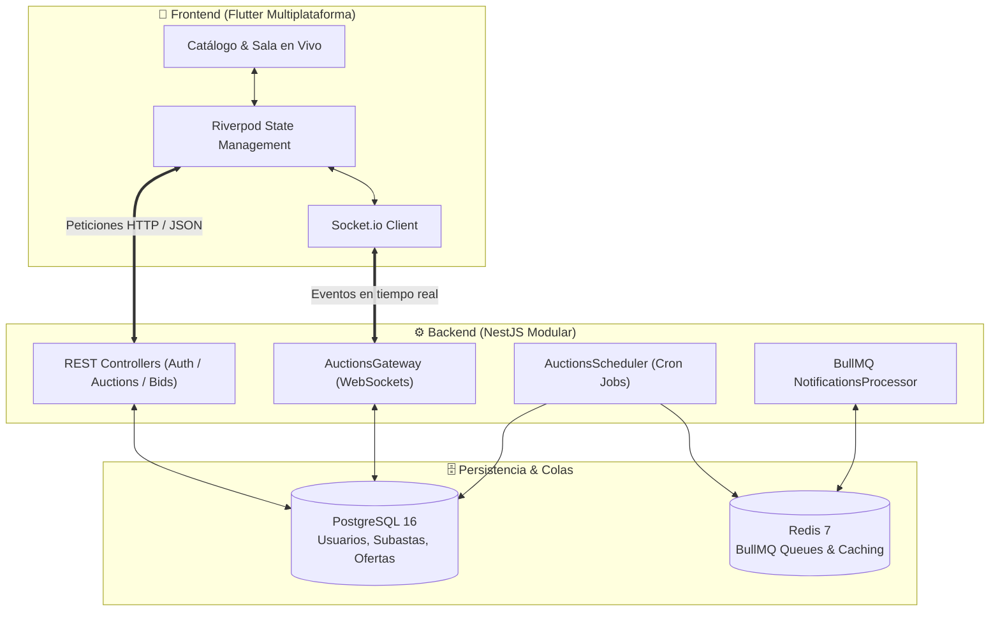

# 🏎️ Carzo · Plataforma de Subastas de Vehículos en Tiempo Real

<p align="center">
  
  
  
  
  
  
</p>

---

## 📌 Descripción del Proyecto

**Carzo** es una solución tecnológica integral de subastas vehiculares en tiempo real diseñada con una arquitectura moderna de alta concurrencia y una experiencia de usuario fluida e interactiva.

La plataforma conecta de forma transparente a **Compradores (Bidders)** y **Vendedores (Sellers)**, permitiendo ofertar segundo a segundo mediante WebSockets, gestionar catálogos con galerías fotográficas de alta fidelidad, automatizar el cierre y adjudicación de vehículos con colas de procesamiento en segundo plano, y consultar métricas clave en vivo.

---

## 🏛️ Arquitectura del Sistema



---

## ✨ Características Principales

### 🎯 Para Compradores (Bidders)
- **Catálogo Activo en Vivo:** Exploración de vehículos con filtros por categoría (*Sedán, Deportivos, SUVs, Pickups, etc.*), búsqueda por texto en tiempo real y ordenamiento inteligente.
- **Tus Ofertas Enviadas:** Sección personalizada en el Home que muestra tus ofertas activas, estado en vivo y si vas ganando la subasta (`Ganando`).
- **Sala de Subasta Interactiva:**
  - Contador regresivo sincronizado al milisegundo.
  - Ofertas en tiempo real con actualización instantánea sin recargar.
  - Alertas automáticas de sobrepuja (*Outbid Notification*).
  - Opción de "Compra Inmediata" (*Buy Out*) cuando esté habilitada por el vendedor.
- **Galería de Alta Fidelidad:**
  - Renderizado completo del vehículo sin cortes indeseados.
  - Visor a pantalla completa con soporte táctil de zoom (*Pinch-to-Zoom*).
- **Historial & Subastas Ganadas:** Perfil con registro de compras, desglose de montos y canal directo de pago y contacto con el vendedor.

### 🚗 Para Vendedores (Sellers)
- **Panel de Control:** Resumen de subastas activas, programadas y cerradas con métricas de rendimiento.
- **Publicación Intuitiva de Vehículos:**
  - Carga múltiple de fotografías.
  - Definición de precio base, incremento mínimo y fecha/hora de inicio y cierre.
  - Opción de precio de venta directa (*Buy Out*).
- **Monitoreo en Tiempo Real:** Seguimiento de las pujas que entran segundo a segundo a cada uno de sus vehículos.

### ⚡ Infraestructura y Confiabilidad
- **WebSockets Bidireccionales:** Comunicación ultrarrápida impulsada por Socket.io.
- **Colas Asíncronas con BullMQ & Redis:** Manejo robusto de notificaciones y cierre automático de subastas sin bloquear el hilo principal.
- **Seguridad RBAC & JWT:** Control de acceso por roles (*bidder* y *seller*) con tokens seguros.

---

## 🛠️ Stack Tecnológico

| Capa | Tecnología | Propósito |
|---|---|---|
| **Frontend** | [Flutter 3.x](https://flutter.dev/) | Aplicación nativa y multiplataforma (iOS, Android, macOS, Web) |
| **Gestión de Estado** | [Riverpod 2.x](https://riverpod.dev/) | Arquitectura reactiva y desacoplada |
| **Backend** | [NestJS 11](https://nestjs.com/) | Framework progresivo y escalable en TypeScript |
| **Base de Datos** | [PostgreSQL 16](https://www.postgresql.org/) | Base de datos relacional con TypeORM |
| **Colas & Mensajería** | [Redis 7](https://redis.io/) + [BullMQ](https://docs.bullmq.io/) | Procesamiento en segundo plano y jobs programados |
| **Tiempo Real** | [Socket.io](https://socket.io/) | Comunicación bidireccional cliente-servidor |
| **Contenedores** | [Docker](https://www.docker.com/) | Orquestación rápida del entorno de desarrollo |

---

## 📂 Estructura del Repositorio

```text
.
├── docker-compose.yml              # Configuración de servicios Docker (Postgres + Redis)
├── README.md                       # Documentación general del proyecto
│
├── ProyectoBack/                   # ⚙️ Backend (API REST + WebSockets NestJS)
│   ├── src/
│   │   ├── auctions/               # Módulo de subastas, gateway WS y scheduler
│   │   ├── auth/                   # Autenticación JWT y guards de rol
│   │   ├── bids/                   # Gestión y validación de pujas
│   │   ├── notifications/          # Procesador de colas BullMQ
│   │   ├── database/               # Configuración TypeORM y migraciones
│   │   └── users/                  # Módulo de usuarios
│   ├── public/images/              # Almacenamiento de imágenes de subastas
│   └── package.json
│
└── FrontFlutter/subastas_app/      # 📱 Frontend (App Móvil / Desktop Flutter)
    ├── lib/
    │   ├── core/                   # Tema, red, widgets reutilizables y utilidades
    │   ├── features/
    │   │   ├── auctions/           # Catálogo, publicación y detalle en vivo
    │   │   ├── auth/               # Login, registro y perfil de usuario
    │   │   └── bids/               # Sala de pujas y controlador reactivo
    │   └── main.dart               # Punto de entrada de la aplicación
    └── pubspec.yaml
```

---

## 🚀 Guía de Instalación y Ejecución

### Prerrequisitos
- [Node.js](https://nodejs.org/) (versión 20 o superior)
- [Flutter SDK](https://docs.flutter.dev/get-started/install) (versión 3.24 o superior)
- [Docker & Docker Desktop](https://www.docker.com/)

---

### Paso 1: Levantar Servicios (Base de Datos y Redis)
Desde la raíz del proyecto o desde `ProyectoBack/`:
```bash
cd ProyectoBack
docker compose up -d
```
> Esto iniciará los contenedores de **PostgreSQL** (puerto `5433` o `5432`) y **Redis** (puerto `6379`).

---

### Paso 2: Configurar y Correr el Backend
1. Entra a la carpeta del backend e instala las dependencias:
   ```bash
   cd ProyectoBack
   npm install
   ```
2. Crea tu archivo `.env` basado en el ejemplo:
   ```bash
   cp .env.example .env
   ```
3. Inicia el servidor en modo desarrollo:
   ```bash
   npm run start:dev
   ```
   El backend estará corriendo en **`http://localhost:3000`**.

---

### Paso 3: Configurar y Correr la Aplicación Flutter
1. Entra a la carpeta de Flutter e instala los paquetes:
   ```bash
   cd FrontFlutter/subastas_app
   flutter pub get
   ```
2. Ejecuta la aplicación en tu dispositivo o emulador preferido:

   - **macOS Desktop:**
     ```bash
     flutter run -d macos
     ```
   - **Simulador iOS:**
     ```bash
     flutter run -d "iPhone 17e"
     ```
   - **Navegador Web (Chrome):**
     ```bash
     flutter run -d chrome
     ```

---

## 🔌 API y Eventos en Tiempo Real

### Endpoints REST Principales
| Método | Endpoint | Descripción | Roles |
|---|---|---|---|
| `POST` | `/auth/login` | Inicio de sesión y generación de JWT | Público |
| `POST` | `/auth/register` | Registro de nuevo usuario (Bidder o Seller) | Público |
| `GET` | `/auctions` | Listado del catálogo de subastas | Público |
| `GET` | `/auctions/:id` | Detalle específico de una subasta | Público |
| `POST` | `/auctions` | Crear y publicar nueva subasta | Seller |
| `POST` | `/auctions/upload-images` | Carga de fotografías del vehículo | Seller |
| `GET` | `/bids/my-bids` | Historial de ofertas del comprador | Bidder |
| `POST` | `/auctions/:id/buy-now` | Compra directa de un vehículo | Bidder |

### Eventos WebSocket (Socket.io)
| Evento | Dirección | Descripción |
|---|---|---|
| `join_auction` | Cliente ➔ Servidor | Unirse a la sala en vivo de un vehículo |
| `place_bid` | Cliente ➔ Servidor | Emitir una nueva oferta con monto |
| `new_bid` | Servidor ➔ Sala | Transmitir la nueva puja más alta a todos los participantes |
| `outbid` | Servidor ➔ Usuario | Notificar al postor anterior que fue superado |
| `auction_started` | Servidor ➔ Global | Notificar el inicio en vivo de una subasta |
| `auction_closed` | Servidor ➔ Sala | Notificar el cierre de la subasta con el ganador |

---

## 📄 Licencia
Este proyecto es de uso privado y educativo. Desarrollado con ❤️ para transformar la experiencia de compra y venta de vehículos en subasta.
